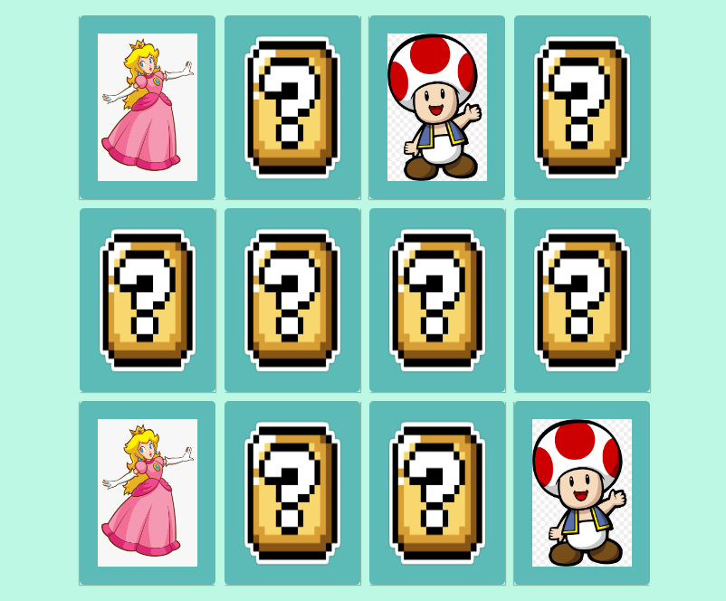

# Jogo da Memória

  

## 💻 Projeto

Esta aplicação é fruto do Bootcamp TQI Fullstack Developer, bootcamp promovido pela TQI e pela Digital Innovation One. Neste projeto, foi requisitado a criação de um jogo da memória utilizando apenas HTML, CSS e Javascript. Para tanto, foram utilizados conceitos de efeitos 3D no CSS e lógica de programação utilizando condicionais, Immediately Invoked Function Expression e manipulação de Array.

## ⚡ Funcionalidades

Principais funcionalidades da aplicação:
- Jogo da memória baseado em personagens dos famosos jogos de Mário.

## 🚀 Tecnologias

Principais tecnologias utilizadas no projeto:
- HTML;
- CSS;
- Javascript.
